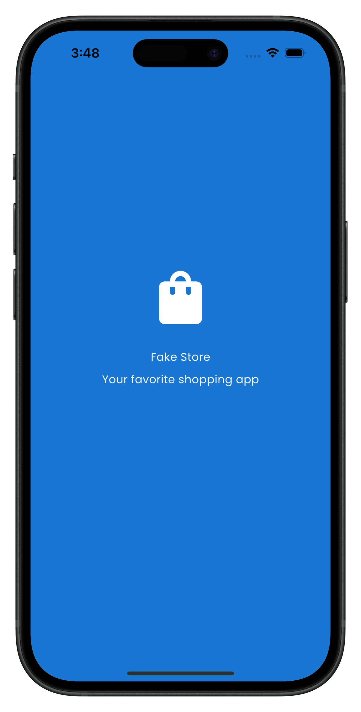
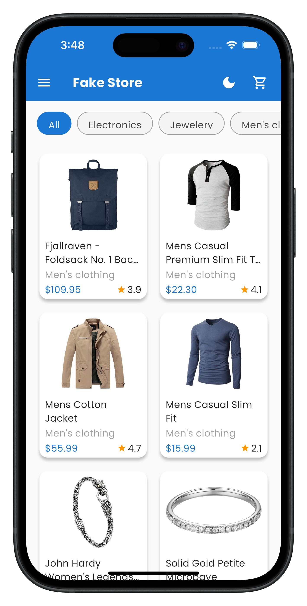
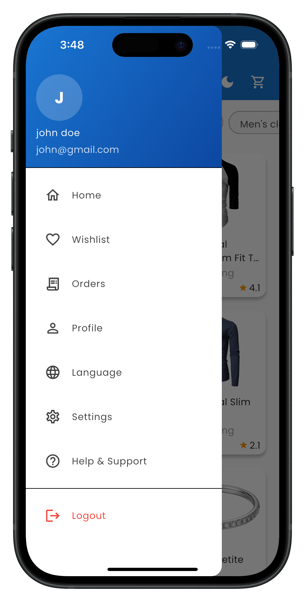
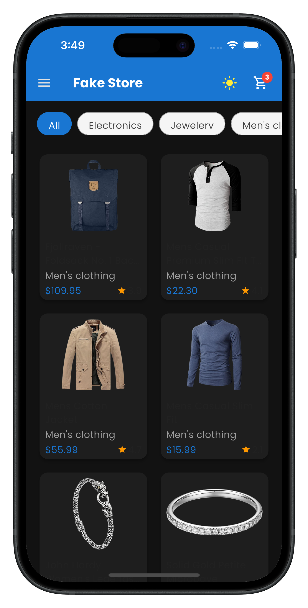
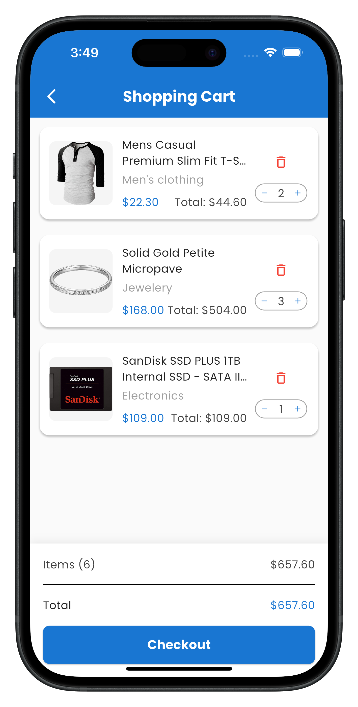

# Fake Store - E-commerce Flutter App

An e-commerce application built with Flutter that consumes the FakeStore API. This project demonstrates clean architecture, modern UI/UX patterns, and comprehensive feature implementation.

## Features

### Core Features
- **Product Catalog**: Browse products with images, titles, prices, and categories
- **Product Details**: View detailed product information with add-to-cart functionality  
- **Shopping Cart**: Manage cart items with quantity updates, removal, and totals
- **Category Filtering**: Filter products by categories with smooth animations

### Advanced Features
- **Theme Switcher**: Toggle between light and dark modes
- **Localization**: Full app localization in English and Arabic (RTL support)
- **Offline Caching**: Smart caching with offline/online transitions
- **Error Handling**: Comprehensive error handling with retry mechanisms
- **Responsive Design**: Adaptive UI using ScreenUtil for different screen sizes

## Architecture

### Clean Architecture Implementation
```
lib/
├── core/                  # Shared utilities and base classes
│   ├── base/              # Base repository implementations  
│   ├── constants/         # API URLs and app constants
│   ├── error/             # Error handling (failures, exceptions)
│   ├── network/           # Network utilities and connectivity
│   ├── theme/             # Theme management and colors
│   └── widgets/           # Reusable UI components
├── features/              # Feature-based modules
│   ├── authentication/    # User authentication (future feature)
│   ├── cart/              # Shopping cart functionality
│   │   ├── data/          # Data sources, repositories, models
│   │   ├── domain/        # Entities, repositories, use cases
│   │   └── presentation/  # UI, cubits, screens, widgets
│   └── product/           # Product catalog and details
│       ├── data/          # API integration and caching
│       ├── domain/        # Business logic and entities
│       └── presentation/  # UI components and state management
└── generated/             # Auto-generated files (localization, DI)
```


## State Management

### BLoC/Cubit Implementation
- **ProductsCubit**: Manages product listing, categories, and filtering
- **ProductDetailsCubit**: Handles individual product detail loading
- **CartCubit**: Shopping cart state management with persistence
- **ThemeCubit**: Theme switching with SharedPreferences persistence
- **LanguageCubit**: Localization state management

### Caching Strategy
- **Smart Caching**: 1-hour expiration for product lists and categories
- **Offline Fallback**: Fallback to cached data when offline

## Technical Stack

### Dependencies
- **flutter_bloc**: State management and reactive programming
- **dio**: HTTP client with interceptors and error handling
- **get_it + injectable**: Dependency injection and service location
- **shared_preferences**: Local data persistence
- **cached_network_image**: Optimized image caching and loading
- **connectivity_plus**: Network connectivity detection
- **flutter_screenutil**: Responsive design utilities
- **shimmer**: Loading animation effects
- **dartz**: Functional programming (Either type for error handling)

### Development Tools
- **build_runner**: Code generation for DI and JSON serialization
- **flutter_lints**: Code quality and style enforcement
- **bloc_test + mocktail**: Testing utilities for BLoC and mocking
- **intl_utils**: Localization code generation

## API Integration

### FakeStore API Endpoints
- `GET /products` - Product catalog
- `GET /products/{id}` - Individual product details
- `GET /products/categories` - Available categories
- `GET /products/category/{category}` - Products by category

### Error Handling Strategy
- **Network Errors**: Automatic retry with exponential backoff
- **Server Errors**: User-friendly error messages with retry options
- **Offline Mode**: Seamless fallback to cached data
- **Loading States**: Proper loading indicators and shimmer effects


## 🧪 Testing

### Testing Strategy
- **Unit Tests**: Business logic and use case testing
- **Widget Tests**: UI component testing with proper mocking
- **Cubit Tests**: State management testing with bloc_test
- **Integration Tests**: End-to-end user flow testing


## 🚀 Getting Started

### Prerequisites
- Flutter SDK 3.32.5+
- Dart SDK 3.5.0+
- Android Studio / VS Code
- iOS Simulator / Android Emulator

### Installation
```bash
# Clone the repository
git clone https://github.com/iqbaltld/fake_store.git
cd fake_store

# Install dependencies
flutter pub get

# Generate code
flutter packages pub run build_runner build

# Generate localization
flutter packages pub run intl_utils:generate

# Run the app
flutter run
```

## 🔧 Configuration

### API Configuration
Update API base URL in `lib/core/constants/api_urls.dart`:
```dart
class ApiUrls {
  static const String baseUrl = 'https://fakestoreapi.com';
  // ... other endpoints
}
```

### Localization
Add new translations in:
- `lib/l10n/intl_en.arb` (English)
- `lib/l10n/intl_ar.arb` (Arabic)

Then run: `flutter packages pub run intl_utils:generate`


## Screenshots

<p align="center">
  
  
  
  
  
</p>


## Author

**Muhammed Iqbal** – [LinkedIn](https://linkedin.com/in/iqbaltld)  